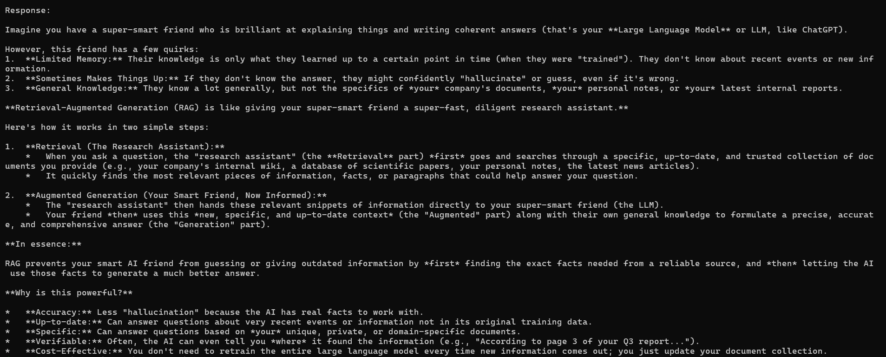

# LangChain LLM Chain

This repository contains a basic LangChain chain implementation using Gemini chat models.

## 1. Project Architecture

- `src/main.py`: Builds and runs a simple LLM chain.
- `.env.example`: Required environment variables.
- `requirements.txt`: Python dependencies.

### Components

- **LLM**: `ChatGoogleGenerativeAI` from `langchain-google-genai`.
- **Prompt**: `ChatPromptTemplate.from_messages` with system and user messages.
- **Output Parser**: `StrOutputParser` to return plain text.
- **Chain Composition**: `prompt | llm | parser`.

## 2. Setup and Installation

### Prerequisites

- Python 3.9+
- Gemini API key (Google AI Studio)

### Steps

1. Create virtual environment:
   ```powershell
   python -m venv .venv
   .\.venv\Scripts\Activate.ps1
   ```
2. Install dependencies:
   ```powershell
   pip install -r requirements.txt
   ```
3. Configure environment variables:
   ```powershell
   Copy-Item .env.example .env
   ```
   Then edit `.env` and set:
   - `GOOGLE_API_KEY`

Note: in the current code, the model is defined directly in `src/main.py` as `gemini-2.5-flash`.

## 3. Run the Project

```powershell
py src/main.py
```

## 4. Example Output

```text
Response:

Retrieval-Augmented Generation (RAG) combines retrieval and generation...
```

## 5. Notes

- The implementation follows LangChain quickstart concepts with explicit chain composition.
- This repository is intended as the "basic LangChain LLM Chain" deliverable.

## 6. Execution Evidence

### Command used

```powershell
py src/main.py
```


